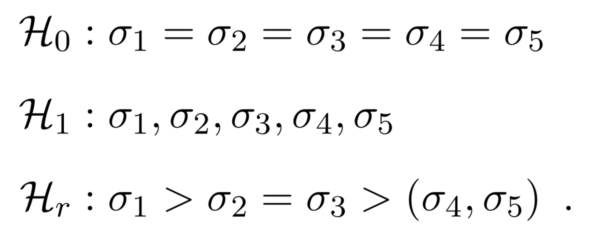

# Bayes factors for Comparing Variances
[](https://travis-ci.org/fdabl/bfvartest)

This R package allows one to test equality, inequality, and mixed hypotheses on independent population variances. The method is described in Dablander, F.<sup>&#11089;</sup>, van den Bergh, D.<sup>&#11089;</sup>, Ly, A., Wagenmakers, E.-J. ([2020](https://arxiv.org/abs/2003.06278)) Default Bayes Factors for Testing the (In)equality of Several Population Variances.

Specifically, the package allows testing hypotheses of the form:

<p align='center' style='padding-top: 1em;'>
  
</p>

## Overview
```r
devtools::install_github('fdabl/bfvartest', build_vignettes = TRUE)
library('bfvartest')
  

# 2.6.1 Testing Against a Single Value
x <- c(6.2, 5.8, 5.7, 6.3, 5.9, 5.8, 6.0)
1 / onesd_test(
    n = length(x), s = sd(x), popsd = sqrt(0.10),
    alpha = 2.16, alternative_interval = c(1, Inf), log = FALSE
)


# 2.6.2 Comparing Measurement Precision
n <- 990
sdigit <- 0.98
slaser <- 0.89
twosd_test(
    n1 = n, n2 = n, sd1 = slaser, sd2 = sdigit,
    alpha = 0.50, alternative_interval = c(1, Inf), log = FALSE
) # H_+ vs H_0


1 / twosd_test(
    n1 = n, n2 = n, sd1 = slaser, sd2 = sdigit, alpha = 0.50, log = FALSE,
    null_interval = c(0.90, 1.10), alternative_interval = c(1.10, Inf)
) # H'_1 vs H'_0


# 2.6.3 Sex Differences in Personality
twosd_test(n1 = 969, n2 = 716, sd1 = 3.95, sd2 = 4.47, alpha = 4.50)


# 3.1.1 The "Standardization" Hypothesis in Archeology
ns <- c(117, 171, 55)
sds <- c(12.74, 8.13, 5.83)
hyp <- c('1=2=3', '1>2>3')
res <- ksd_test(hyp = hyp, ns = ns, sds = sds, alpha = 0.50)
res$BF


# 3.1.2 Increased Variability in Mathematical Ability
ns <- c(3280, 6007, 7549, 9160, 9395, 6410)
sds <- c(5.99, 5.39, 4.97, 4.62, 3.69, 3.08)
hyp <- c('1=2=3=4=5=6', '1,2,3,4,5,6', '1>2>3>4>5>6')
res <- ksd_test(hyp = hyp, ns = ns, sds = sds, alpha = 0.50)
res$BF


# For more, browse the vignette
browseVignettes('bfvartest')
```
